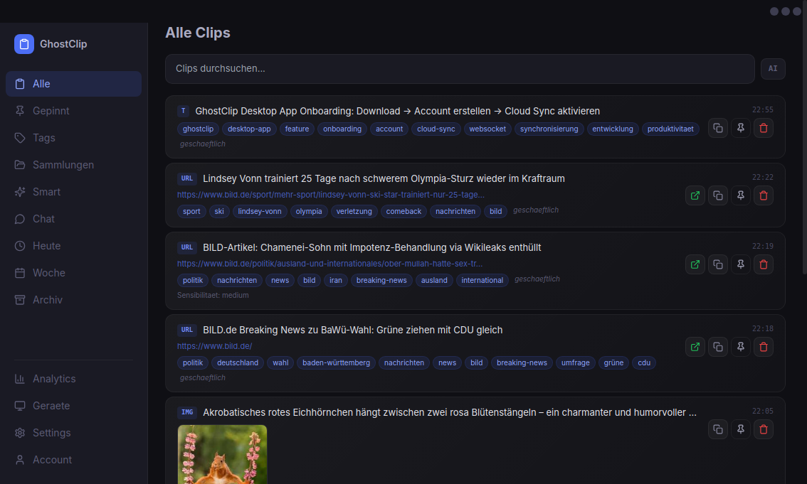
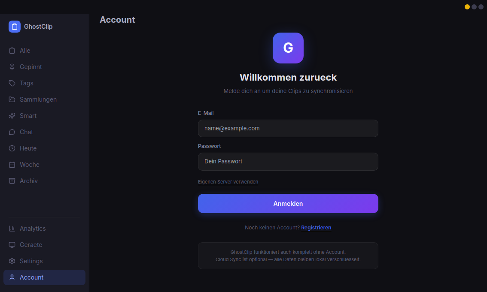
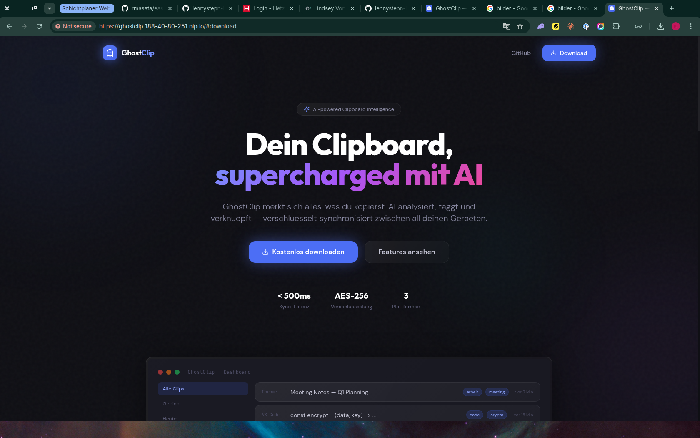

<div align="center">

<br/>

<br/>

# GhostClip

**AI-Powered Clipboard Manager with Cloud Sync**

[](https://github.com/lennystepn-hue/ghostclip/releases)
[](https://www.typescriptlang.org/)
[](LICENSE)
[](https://www.electronjs.org/)
[]()

<br/>

[Download](#-download) · [Features](#-features) · [Screenshots](#-screenshots) · [Self-Hosting](#-self-hosting) · [Architecture](#-architecture) · [Contributing](#-contributing)

<br/>
</div>

---

## What is GhostClip?

> Copy anything. GhostClip remembers it, understands it with AI, and syncs it across all your devices.

GhostClip runs silently in your system tray, capturing every clipboard entry — text, images, URLs, code snippets. Each clip gets analyzed by AI in real-time: auto-tagged, summarized, classified by mood and sensitivity. Reply suggestions for messages, OCR for screenshots, semantic search across your entire clipboard history.

**Works offline.** All core features run locally on your machine. Cloud sync and server-side AI are optional — create an account only if you want cross-device sync.

---

## Download

| Platform | Download | Format |
|----------|----------|--------|
| **Linux** | [GhostClip-0.1.0-x86_64.AppImage](https://github.com/lennystepn-hue/ghostclip/releases/latest/download/GhostClip-0.1.0-x86_64.AppImage) | AppImage |
| **Linux** | [GhostClip-0.1.0-amd64.deb](https://github.com/lennystepn-hue/ghostclip/releases/latest/download/GhostClip-0.1.0-amd64.deb) | Debian/Ubuntu |
| **macOS** | [GhostClip-0.1.0-x64.dmg](https://github.com/lennystepn-hue/ghostclip/releases/latest/download/GhostClip-0.1.0-x64.dmg) | DMG |
| **Windows** | [GhostClip-0.1.0-x64.exe](https://github.com/lennystepn-hue/ghostclip/releases/latest/download/GhostClip-0.1.0-x64.exe) | Installer |

Or build from source — see [Self-Hosting](#-self-hosting).

---

## Features

### AI Intelligence (automatic, per clip)
- **Auto-tagging** — AI generates relevant tags for every clip
- **Summaries** — one-line description of what you copied
- **Mood detection** — business, private, creative, urgent, etc.
- **Sensitivity detection** — flags passwords, tokens, personal data
- **Reply suggestions** — detects messages and generates 3 reply options
- **Vision & OCR** — analyzes images, extracts text from screenshots
- **AI Chat** — ask questions about your clipboard history
- **Auto-learning** — AI adapts to your patterns and vocabulary over time

### Clipboard Management
- **All types** — text, URLs (with page content), images, code, files
- **Search** — full-text and semantic (AI-powered) search
- **Tags, Collections, Smart Filters** — organize your clips
- **Pin & Archive** — keep important clips, hide old ones
- **Auto-expire** — sensitive data gets deleted automatically
- **URL content** — stores page title, description, and text for search

### Cross-Platform
- **Desktop App** — Electron (Linux, macOS, Windows)
- **Web Dashboard** — access from any browser
- **System tray** — always running, out of the way
- **Floating widget** — quick access to recent clips and replies

### Cloud Sync (optional, with account)
- **Real-time sync** via WebSocket
- **Offline queue** — works without internet, syncs when reconnected
- **Conflict resolution** — handles edits from multiple devices
- **Account system** — register directly in the app
- **Server-side AI** — AI features work even without local API keys

---

## Screenshots

### Desktop App — Clip Feed
AI-tagged clips with URLs, images, text — all auto-enriched.



### Desktop App — Account & Login
Create an account for cloud sync directly in the app.



### Landing Page



---

## Self-Hosting

### Prerequisites

- **Node.js** >= 22
- **pnpm** >= 9
- **Docker** (for PostgreSQL, Redis)

### 1. Clone & Install

```bash
git clone https://github.com/lennystepn-hue/ghostclip.git
cd ghostclip
pnpm install
```

### 2. Start Infrastructure

```bash
docker compose up -d
```

This starts PostgreSQL (with pgvector), Redis, and MinIO.

### 3. Configure

```bash
cp apps/server/.env.example apps/server/.env
# Set your keys:
#   ANTHROPIC_API_KEY=sk-ant-...   (or leave empty to use Claude OAuth)
#   JWT_SECRET=your-random-secret
```

### 4. Initialize Database

```bash
cd apps/server && pnpm db:init
```

### 5. Run

```bash
# Server (API + WebSocket sync)
cd apps/server && pnpm dev

# Web Dashboard
cd apps/web && pnpm dev

# Desktop App
cd apps/desktop && pnpm dev
```

### 6. Build Desktop Installers

```bash
cd apps/desktop
pnpm build
npx electron-builder --linux AppImage deb
npx electron-builder --mac dmg
npx electron-builder --win nsis
```

Installers land in `apps/desktop/release/`.

---

## Architecture

```
ghostclip/
├── apps/
│   ├── server/          # Express API + Socket.io sync + AI proxy
│   ├── web/             # Next.js 15 landing page + dashboard
│   └── desktop/         # Electron + Vite + React
│
├── packages/
│   ├── shared/          # Types, Zod validators, constants
│   ├── crypto/          # AES-256-GCM encryption
│   ├── ai-client/       # Claude API (enrich, reply, chat, vision)
│   └── ui/              # Shared React components + design system
│
└── .github/workflows/   # CI + Release (Linux, macOS, Windows)
```

### How AI Works

```
User copies text/image/URL
       │
       ├── Local mode: Claude OAuth token (~/.claude/.credentials.json)
       │   └── Direct call to Anthropic API
       │
       └── Cloud mode: Logged-in user
           └── Desktop App → Server API → Anthropic API
                                (server uses its own API key)
```

- **Enrichment**: Claude Haiku 4.5 (fast, cheap — tags + summary)
- **Chat & Replies**: Claude Sonnet 4.6 (smart — conversations)
- **Vision/OCR**: Claude Sonnet 4.6 (image understanding)

### Tech Stack

| Layer | Technology |
|-------|-----------|
| **Desktop** | Electron 33 + Vite + React 19 |
| **Web** | Next.js 15 (App Router) |
| **Server** | Express + Socket.io |
| **Database** | PostgreSQL 16 + pgvector |
| **Cache** | Redis 7 |
| **Storage** | S3 / MinIO |
| **AI** | Claude API (Anthropic) |
| **Encryption** | AES-256-GCM + PBKDF2 |
| **UI** | Tailwind CSS + Framer Motion |
| **CI/CD** | GitHub Actions (multi-platform) |

---

## Keyboard Shortcuts

| Shortcut | Action |
|----------|--------|
| `Ctrl+Shift+V` | Open Quick Panel |
| `Ctrl+Shift+R` | Reply Suggestions |

---

## Contributing

```bash
git clone https://github.com/YOUR_USER/ghostclip.git
cd ghostclip && pnpm install
git checkout -b feat/my-feature

# Make changes, test
pnpm turbo test

# Commit & PR
git commit -m "feat: add my feature"
git push origin feat/my-feature
```

- TypeScript strict mode
- Conventional commits (`feat:`, `fix:`, `chore:`)
- One feature per PR

---

## License

MIT — see [LICENSE](LICENSE) for details.

---

<div align="center">
<br/>

**Built by [Lenny Enderle](https://github.com/lennystepn-hue)**

*Your clipboard. Your data. Your AI.*

<br/>
</div>
